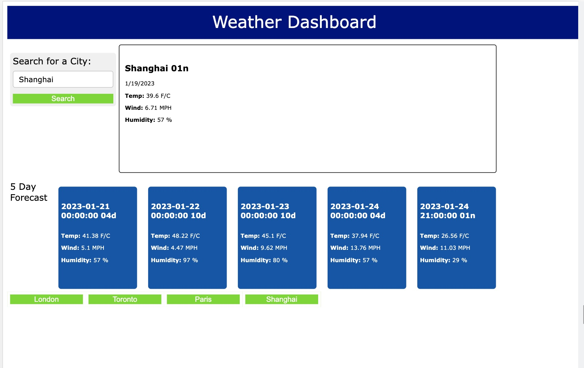

# Weather Dashboard

Link to live site: [https://conniehhw.github.io/weather-dashboard/](https://conniehhw.github.io/weather-dashboard/) 

## Description

A single webpage designed to check the weather - retrieving current and the next five days forecast for cities. This weather dashboard runs in the browser and feature dynamically updated HTML and CSS. Designed for users who may have travel plans and want to see the weather outlook for multiple cities. 

Upon searching for a city, users are presented with current and future conditions for that city. For ease of use, the forecasts include the city name, an icon representing the weather (raining, sunny, etc), the temperature, the humidity and wind speed. Additional benefits include the app's capability to store previous city searches, allowing the user to retrieve the data again when they need it. 

## Installation

This app runs in the browser and feature dynamically updated HTML and CSS. The weather data is accessed from the Open Weather Organization APIs [https://openweathermap.org/api] (https://openweathermap.org/api) and uses the browsers localStorage to store city queries.

## Preview & Usage

1. Navigate to the webpage.
2. In the input form, type in the city you wish to query and click on the search button.
3. The city's current and five day weather forecast data is retrieved from the Open Weather Map Org APIs [https://openweathermap.org/api](https://openweathermap.org/api) and displayed in its box. 
4. Upon clicking the search button, a new button labelled with the city name is also created on the bottom of the page.
5. When you click on any of those buttons, it will retreive that city's weather and forecast.

## License

There were no licenses obtained for this project. For more information on licenses, follow this link:
[https://choosealicense.com/](https://choosealicense.com/).